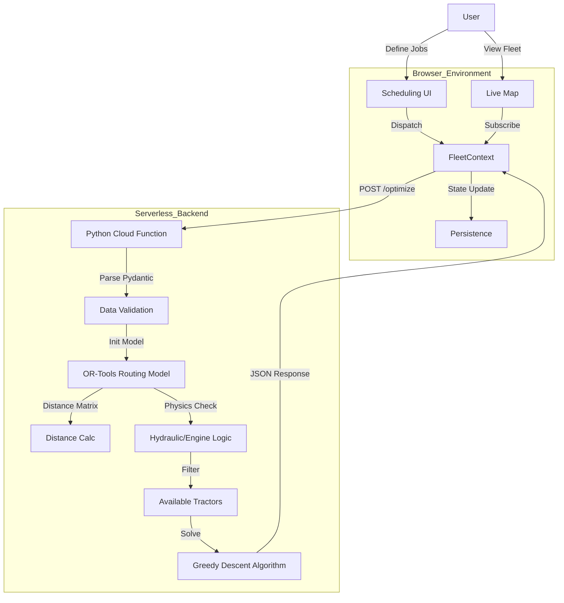

# EagleSight - Intelligent Fleet Command System


**[Live Preview](https://eaglesight.deniyi.link/) | [GitHub Repository](https://github.com/HectorGitt/eagle-fleet-command) | [Read the Case Study on Medium](#)**

EagleSight is a comprehensive fleet management and agricultural logistics platform designed to optimize tractor operations, monitor real-time telemetry, and solve complex Vehicle Routing Problems (VRP) in modern agriculture. By bridging the gap between **Real-time Telemetry** and **Operations Research**, it solves the "Last Mile" problem of farm machinery—ensuring the right tractor is at the right field at the right time, while monitoring for critical mechanical failures.

---

## 🚀 Key Features

*   **Real-Time Telemetry**: Monitor GPS location, engine health, fuel levels, and activity status of the entire fleet.
*   **Intelligent Scheduling (VRP)**: Optimize daily schedules using Google OR-Tools to minimize distance and conflicts while respecting time windows.
*   **Smart Location Picker**: Integrated forward and reverse geocoding for easy job creation.
*   **Predictive Maintenance**: "Physics-aware" logic that automatically grounds tractors at risk of failure (e.g., thermal breakdown).
*   **Interactive Maps**: Live visualization of fleet positions and optimized route polylines.

---

## 🛠️ Technological Stack & Rationale

| Layer | Technology | Rationale |
| :--- | :--- | :--- |
| **Frontend** | **React 18 + Vite** | High-performance rendering for map overlays; fast HMR for rapid iteration. |
| **UI Framework** | **Shadcn/UI + Tailwind** | Provided a composable, accessible design system that feels "premium" and data-dense without clutter. |
| **State** | **React Context API** | Avoided Redux bloat. Used a centralized `FleetContext` to drive the "Single Source of Truth" for telemetry. |
| **Maps** | **React-Leaflet** | Lightweight alternative to Google Maps SDK. flexible enough for custom SVG markers and dynamic polyline routing. |
| **Backend** | **Python 3.10** | Native environment for Data Science libraries (NumPy, OR-Tools). |
| **Compute** | **Google Cloud Functions** | Serverless "Scale-to-Zero" architecture perfect for sporadic, compute-heavy optimization jobs. |
| **Solver** | **Google OR-Tools** | Industry-standard Constraint Programming (CP) library for solving VRP and TSP variants. |

---

## 🏗️ Architectural Deep Dive

### 3.1 The "Hybrid State" Pattern
One of the core challenges was managing two conflicting types of state:
1.  **Ephemeral UI State**: Is the modal open? Which tab is active?
2.  **Persistent Fleet State**: Where is Tractor T-800? What is its fuel level?

We implemented a **Hybrid Provider Pattern** in `FleetContext.tsx`. Instead of scattering `useState` hooks across pages, the Context acts as the central brain.

```typescript
// Simplified FleetContext Logic
export const FleetProvider = ({ children }) => {
    // Single Source of Truth
    const [tractors, setTractors] = useState<Tractor[]>(initialData);

    // Actions that mutate state deeply without prop-drilling
    const updateTractorStatus = (id, status) => { ... };
    const loadOptimizedSchedule = (newSchedule) => { ... };

    return (
        <FleetContext.Provider value={{ tractors, updateTractorStatus, loadOptimizedSchedule }}>
            {children}
        </FleetContext.Provider>
    );
};
```
This allowed the **Map Component** to react instantly when the **Scheduling Component** updated a route, even though they live on different parts of the component tree.

### 3.2 System Architecture Diagram
The data flow is bidirectional but asymmetric. The Frontend pushes *constraints* (jobs, time windows), and the Backend pushes *solutions* (routes, alerts).



---

## 🧠 Algorithmic Core: Solving the VRP

The Vehicle Routing Problem (VRP) is NP-Hard. For EagleSight, we implemented a specialized variant: **VRPTW (Vehicle Routing Problem with Time Windows)** with multiple constraints.

### 4.1 The Cost Function
The solver doesn't just minimize distance; it minimizes a weighted cost function:
$$ Cost = (\alpha \times Distance) + (\beta \times TimeViolation) + (\gamma \times VehicleUsage) $$

In our Python implementation (`solver.py`), we effectively "bribe" the solver to drop jobs rather than crash if constraints are impossible to meet. This is done via **Disjunctions**:

```python
# Penalty for dropping a job is 100,000 "cost units"
# This forces the solver to include the job UNLESS it requires > 100km travel
penalty = 100000
for node in range(1, len(data['locations'])):
    routing.AddDisjunction([manager.NodeToIndex(node)], penalty)
```

### 4.2 Dynamic Geolocation & Haversine
We moved away from Euclidean distance (x,y) to Geodetic distance (Latitude/Longitude). This required implementing the Haversine formula directly in the distance callback matrix.
*   **Why?**: A "straight line" on a map in Nigeria is curved on the globe. For accurate fuel estimation, we need the Great Circle distance.

### 4.3 The "Subscriptable" Bug & Pydantic
During development, we faced a critical crash: `TypeError: 'TractorSchedule' object is not subscriptable`.
*   **Context**: FastAPI uses **Pydantic** models for request validation. These look like classes (`item.id`).
*   **Conflict**: Our solver logic was written for standard Dicts (`item['id']`).
*   **Solution**: We implemented a sterilization layer using `.dict()` before feeding the optimization engine.

---

## 🔧 Challenges & Solutions

### Challenge 1: The "Vanishing" Map State
**Problem**: When switching between the "Overview" and "Live Map" tabs, the map would reset to default zoom/center.
**Solution**: We lifted the map state (center, zoom) into the `FleetContext`. Now, the state persists across navigation events, preserving the user's context.

### Challenge 2: Capacity Overflow
**Problem**: Users would add 50 hours of work for a fleet with 40-hour capacity. The solver would simply return an empty solution.
**Solution**: By implementing the **Disjunction/Penalty** logic described in Section 4.1, we created a robust "Unassigned Jobs" backlog. This turned a *system failure* into a *user feature*, allowing fleet managers to see exactly which jobs need to be outsourced or delayed.

---

## 🚦 Getting Started

### Prerequisites
*   Node.js (v18+)
*   Python (v3.10+)

### 1. Frontend Setup
```bash
# Install dependencies
npm install

# Create .env file
cp .env.example .env

# Start Development Server
npm run dev
```
The app will be available at `http://localhost:8080`.

### 2. Backend Setup
```bash
# Navigate to backend directory
cd backend

# Install Python dependencies
pip install -r requirements.txt

# Start FastAPI Server
python main.py
```
The API will run at `http://localhost:8000`.

## 📄 License
This project is licensed under the MIT License.
